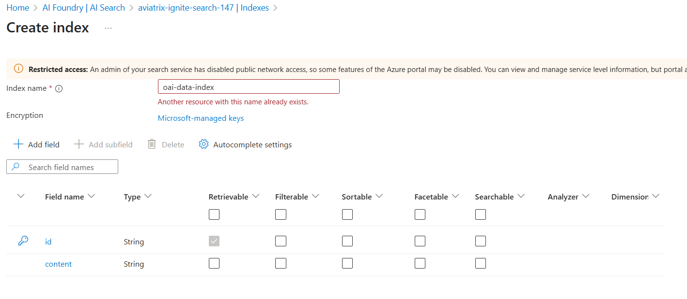
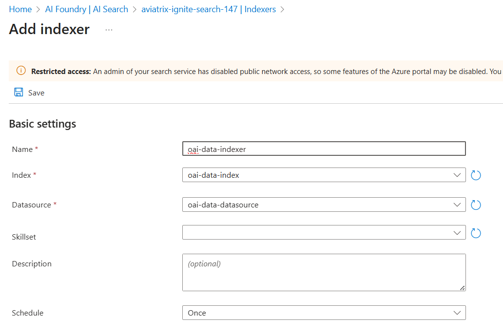

# Manual steps

Application used in this lab is available at https://github.com/microsoft/sample-app-aoai-chatGPT

1. Upload data file to storage account in oai-data container

2. Create index and indexer in openai search (not available in TF yet)

3. To do
- Generate AWS VM cloud-init to pre configure with Chatbot app
- Add AWS spoke deploy to current folder
- Try to add image into the model / index
- Do not forget to configure DNS for the workstation admin or via VPN to access Azure Portal over Private

